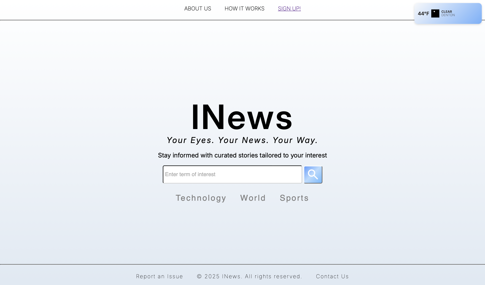
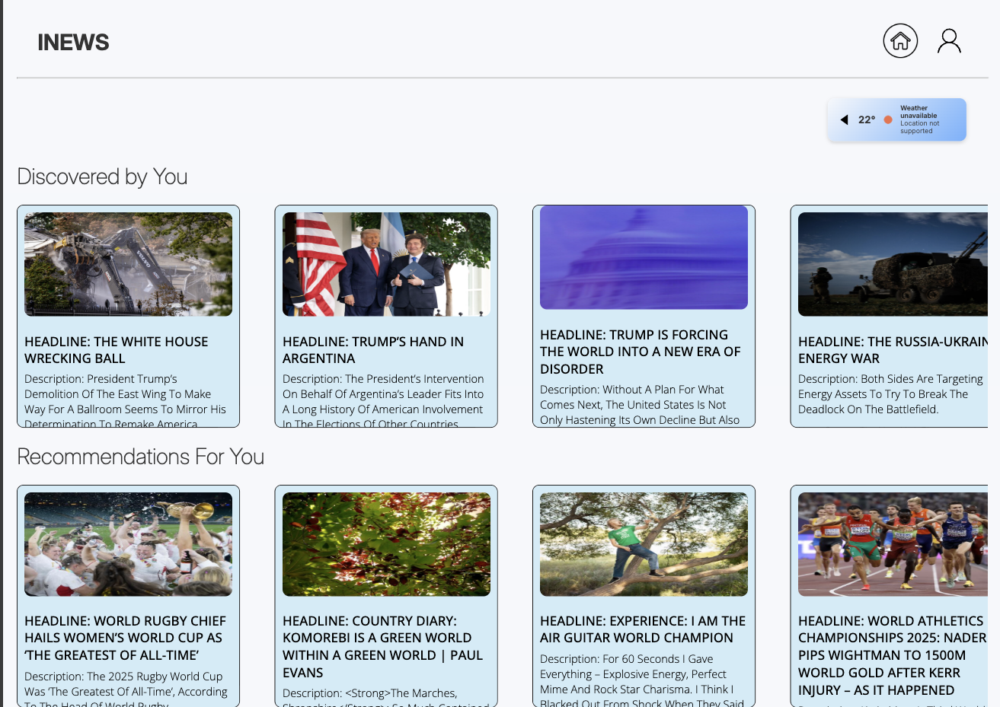
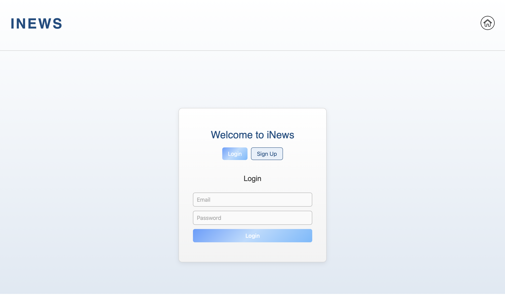

## Team Name : S2-P2

#  Project : INews 
Inews is a personalized news discovery web application aimed at giving users only the stories they care about. Users search for a term
and the app aggreates multiple live articles from multiple news sources.

# Live Site

# Features
-  Personalized News Feed
- Live Weather integration
- User Authentication (login/signup)
- Onboarding Survey 
- AI powered Recommendation System 
- Local article saving

# Tech Stack
 - Node.js
 - MongoDB
 - Express
 - Html,Css,Javascript

# Team Members

 1. Eneojo Unwuchola
2. Sreya
 3. Kallen 
 4. Nguyen Vy Nhan(Monica) Vu

 # Screenshots 
 
  
   
   
    

